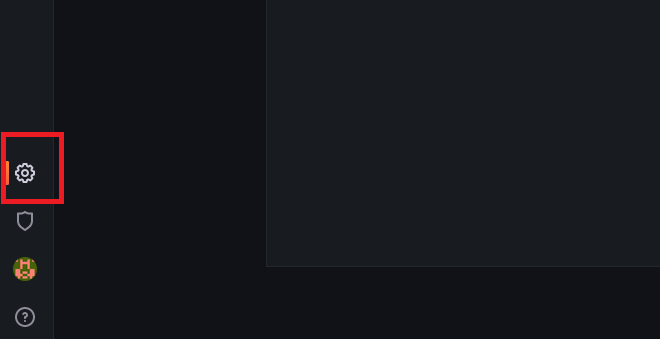
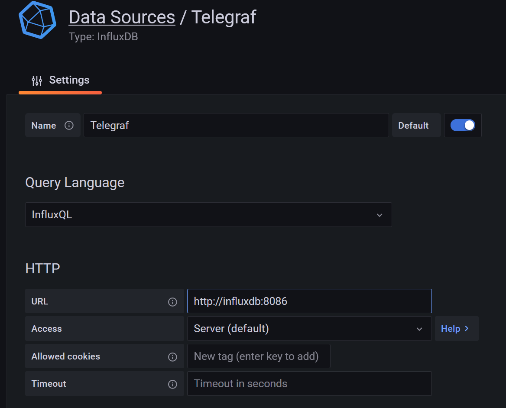
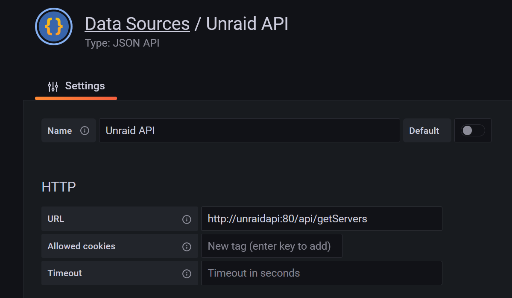
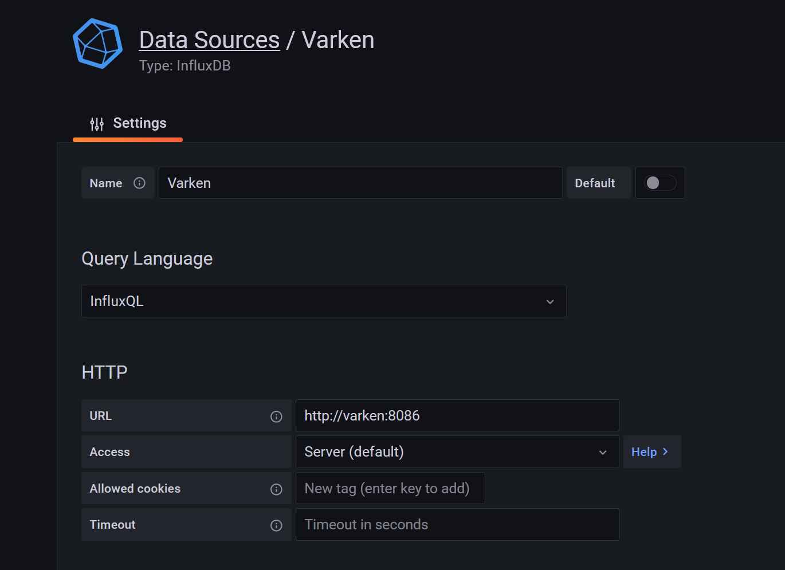

# Ultimate Unraid Dashboard Docker-Compose

Community Developer 'falconexe' over at the unraid forums has built and maintained the amazing [Ultimate Unraid Dashboard](https://forums.unraid.net/topic/96895-ultimate-unraid-dashboard-uud/), which is a stack of applications to gather and display data for the server admin. It consists of:

- [InfluxDB](https://www.influxdata.com/) - A time series database for storing data
- [Telegraf](https://www.influxdata.com/time-series-platform/telegraf/) - An Agent for collections server metrics and storing them in influxdb
- [UnraidAPI](https://github.com/ElectricBrainUK/UnraidAPI) - A WIP open source api for the UnRaid operating System
- [Varken](https://github.com/Boerderij/Varken) - A plex agent for collection stats from common Plex apps and storing them in InfluxDB
- [Grafana](https://grafana.com/) - An incredible data visualization tool

Since this setup relies on so many different containers and configuration files, there have been attempts to 'ease' users into it with 'all-in-one' solutions (like testdasi's abandoned [grafana-unraid-stack](https://github.com/testdasi/grafana-unraid-stack) project), but it felt more realistic to use Docker-Compose for the job. 

## Prerequisites:
- A Functioning Unraid Operating System
- Docker Compose Manager plugin

### Installation

- With the Docker-Compose-Manager plugin installed, scroll to the bottom of the 'Docker' tab and press 'Add New Stack'
- Enter a name, and hit okay
- Scroll back down, and Press the Gear next to the Stack you just created
- Under 'Edit env', copy the .env variables from this repository, and paste them into the textbox. Replace any of the variables with data according to your UnRaid Setup
  - TZ - Your Timezone
  - APPDATA_PATH - The path to your appdata share
    - If you want to bypass the unraid fs layer, you can put '/mnt/YOURCACHEDISKNAME/appdata'
  - UNRAID_API_UI_PORT - The Port you will access your 'UnraidAPI' container through
  - GRAFANA_UI_PORT = The Port you will access your 'Grafana' container through
  - GF_SERVER_ROOT_URL - The Grafana Server Root url. 
    - Usually this is your IP address, since you'll be accessing it via 'http://YOURIP:YOURPORT
  - GF_SECURITY_ADMIN_PASSWORD - Your Secret Admin Password for Grafana

- Scroll down, press the gear again, and hit 'Edit Stack'
- Copy and paste the 'Ultimate_Unraid_Dashboard.yml' contents into your text box. 
  - Since Docker-Compose uses its own network, only ports set in the .env will clash with your unraid docker ports. Other ports are seen by other containers in the network with the 'expose' setting 
- **This is not the end of your setup. Some containers require a Config file to be made, and will not start without them. Varken and Telegraf are the main two.**

### Config

#### Varken
- In your /mnt/user/appdata, create a folder called 'GUS-varken'
  - You can change this, but you'll need to edit the Docker-Compose stack if you do.
- Download the 'varken.ini' file in the /appdata/GUS-varken folder of this repository
- The Varken.ini file consists of individual 'blocks' for each service you configure with it. You will need to go into each instance of tautulli/sonarr/radarr/lidarr/sickchill/ombi in order to set up the information like URLs and API Keys for each individual block
  - Read carefully, because there's a few ways to format things like ips/ports
- Once all of your services you want to connect are configured in the varken.ini, place it into your appdata/GUS-varken folder on your server

#### Telegraf
*The .conf file was created by [skaterpunk](https://github.com/skaterpunk/UUD). All credit goes to him for trimming it down to what's required*

- In your /mnt/user/appdata, create a folder called 'GUS-telegraf'
- Download the 'telegraf.conf' file found in the /appdata/GUS-telegraf folder of this repository
- Most of the config should be done. You may need to change is the influx username/password, if you set them, but the Docker-Compose doesn't specify any.
- In the 'telegraf.conf, uncomment either the [[inputs.hddtemp]\] or the [[inputs.ipmi_sensor]\] line, depending on your method of gathering data
  - If you use server hardware, it will likely be the ipmi line, and you'll need the plugin
  - If you use consumner hardware, hddtemp will likely suffice
- Move your telegraf.conf to the appdata/GUS-telegraf folder on your server

*Again, massive thanks to skaterpunk for doing the hard config work*

#### Grafana
- Hit the 'Compose Up' button in the 'Docker' UnRaid tab, the 'Docker Compose Down', then 'Docker Compose Up' again
  - This is to ensure the Grafana Plugins are installed/recognized properly
- The Actual Grafana Dashboard is found in the [official forum post](https://forums.unraid.net/topic/96895-ultimate-unraid-dashboard-uud/). Scroll down to the attachments in the main post, and download the 'Current' version.

- Because Docker Compose can refer to other devices by container name, there are a few things that need to be changed in the Grafana WebUI configuration.
- Log into Grafana, and hit the 'Configuration' on the left side panel
  
- In the configuration, you will need to edit the Telegraf, UnraidAPI, and Varken data sources. 
- Replace your current IP in them with the container names 'telegraf', 'unraidapi', 'varken'
**Telegraf** - The 'Database' field at the bottom is 'telegraf', and the 'username' field at the bottom is 'telegraf'
  
**UnraidAPI**

**Varken** - The 'Database' field at the bottom is 'telegraf', and the 'username' field at the bottom is 'telegraf'

If you've uploaded the dashboard found at falconexe's forum page, then you should be close to finished. You can close the configuration screen, and go to your dashboard. You should also need to set the variables at the top of your dashboard to match the information related to your setup. I highly recommend checking final configs with the official setup instructions found in the Unraid Forums: https://forums.unraid.net/topic/96895-ultimate-unraid-dashboard-uud/ as I just wanted to get you up and running with docker-compose. 